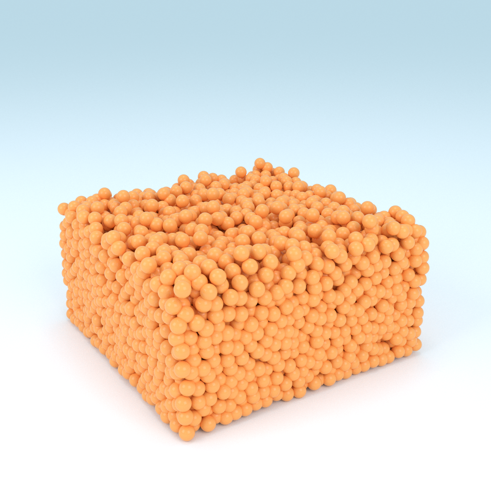
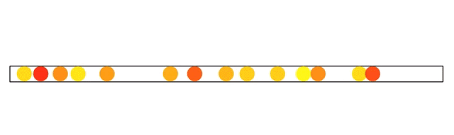

# mdsea

mdsea is a stand-alone Python molecular dynamics library equipped with a
flexible simulation engine and multiple analysis tools, including
integrated beautiful visualization in 1, 2, and 3 dimensions.


## Getting started


### Prerequisites

mdsea requires **Python >= 3.6**. The
**minimal** requirements for this project will be automatically
installed with `setup.py`.


### Installing

To install mdsea you need to get the source and execute the `setup.py`
script

```sh
git clone https://github.com/TPVasconcelos/mdsea.git
cd mdsea
python3 setup.py install
pip3 install -r requirements.txt
```


### Extra requirements

In order to install the complete set
of requirements and be able to make the most use of mdsea run

```sh
pip3 install -r requirements.txt
```

To render 3D animation with [Blender](https://www.blender.org), you will
need to [download](https://www.blender.org/download/) and install it on
your machine first. If you want mdsea to render mp4 animation files
for you, you will also need to
[install ffmpeg](https://www.ffmpeg.org/download.html).


## Running the tests

You can find the test scripts inside the `/tests` directory.

You should start by running
```sh
python3 initsetup.py
```

which will run a default simulation and store in in
`./simfiles/_mdsea_testsimulation/*`. You can then run tests for the
multiple visualization tools (`/tests/vis_*.py`). See bellow how to run
the Blender tests! The `/tests/cleanup.py` script will remove the
`/simfiles/_mdsea_testsimulation` directory.

### Running Blender tests

Blender uses its own python interpreter, so you will need to install
mdsea there as well. Find out where the python binary is stored and
execute the following command. e.g. on macOS:
```sh
cd mdsea
/path/to/blender.app/Contents/Resources/2.XX/python/bin/python setup.py  install --force
```

To run the tests, execute
```sh
cd tests
/path/to/blender.app/Contents/MacOS/blender --python vis_blender.py
```

I'd also suggest that you add
```
alias blender=/path/to/blender.app/Contents/MacOS/blender
```
to `.bash_profile` and `.profile`.

```sh
echo "alias blender=/path/to/blender.app/Contents/MacOS/blender" >> ~/.profile
echo "alias blender=/path/to/blender.app/Contents/MacOS/blender" >> ~/.bash_profile
```

In
[Blender’s documentation](https://docs.blender.org/manual/en/dev/render/workflows/command_line.html#platforms)
they only state the alias in `~/.profile` but this is only read by
_login_ shells. On the other hand, `~/.bash_profile` is read by
_interactive_ shells (like the one linked to Terminal).


## Example

```python
#!/usr/local/bin/python3
# coding: utf-8
import mdsea as md

# Instantiate system manager
sm = md.SysManager.new(ndim=2, num_particles=8 ** 2, steps=1000,
                       vol_fraction=0.4, radius_particle=0.5,
                       pot=md.Potential.lennardjones(1, 1))

# Generate initial velocities
vgen = md.VelGen(ndim=sm.NDIM, nparticles=sm.NUM_PARTICLES)
sm.v_vec = vgen.mb(sm.MASS, sm.TEMP, sm.K_BOLTZMANN)

# Generate initial positions
cgen = md.CoordGen(ndim=sm.NDIM, nparticles=sm.NUM_PARTICLES,
                   boxlen=sm.LEN_BOX)
sm.r_vec = cgen.simplecubic()

# Run the simulation
sim = md.ContinuousPotentialSolver(sm)
sim.run_simulation()

# Run 2D animation with matplotlib
from mdsea.vis.mpl import Animation

anim = Animation(sm, frame_step=6)
anim.anim()
```

The output should look something like (You can ignore the warning):
```
[INFO:mdsea.core] New simulation: {'id': '153833190314711', 'path': 'simfiles/153833190314711'}
[WARNING:mdsea.core] A ValueError ('Not a location (invalid object ID)') was catched while trying to update a dataset. However, we noticed that the datafile in question wasn't open. We'll try to fix this and retry...
[INFO:mdsea.simulator] ProgresBar (Simulator): {'step': '55/1000', 'percentage': 6, 'ETA': '1s'}
...
[INFO:mdsea.simulator] ProgresBar (Simulator): {'status': 'finished', 'lifetime': '2.6s'}
[INFO:mdsea.vis.mpl] Plotting anim_loop...
```


## Galery

### 3D renderings




### GIFs
**1D Simulation:**

**2D Simulation:**

**3D Simulation with Blender's Cycles rendering engine:**


---

## Licence

[MIT License](./LICENSE)
